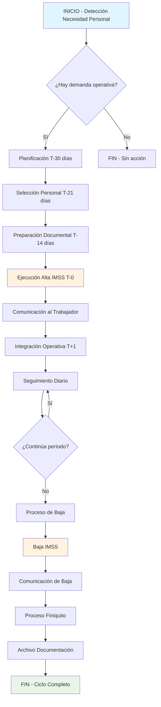
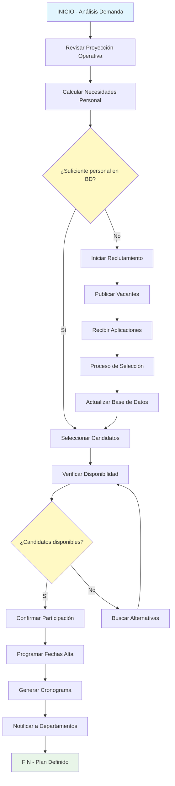
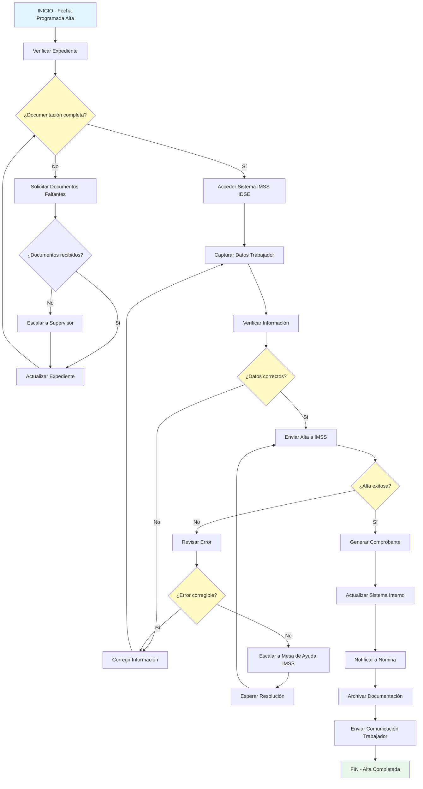
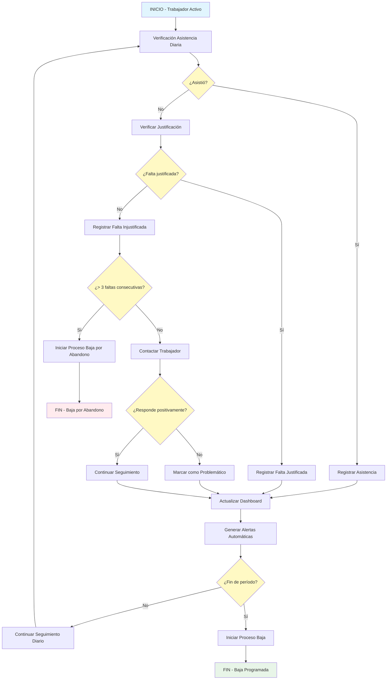
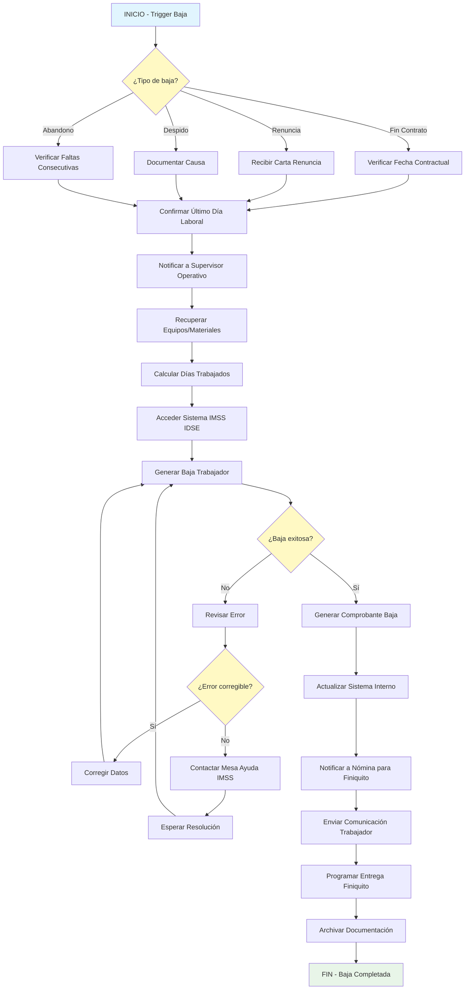
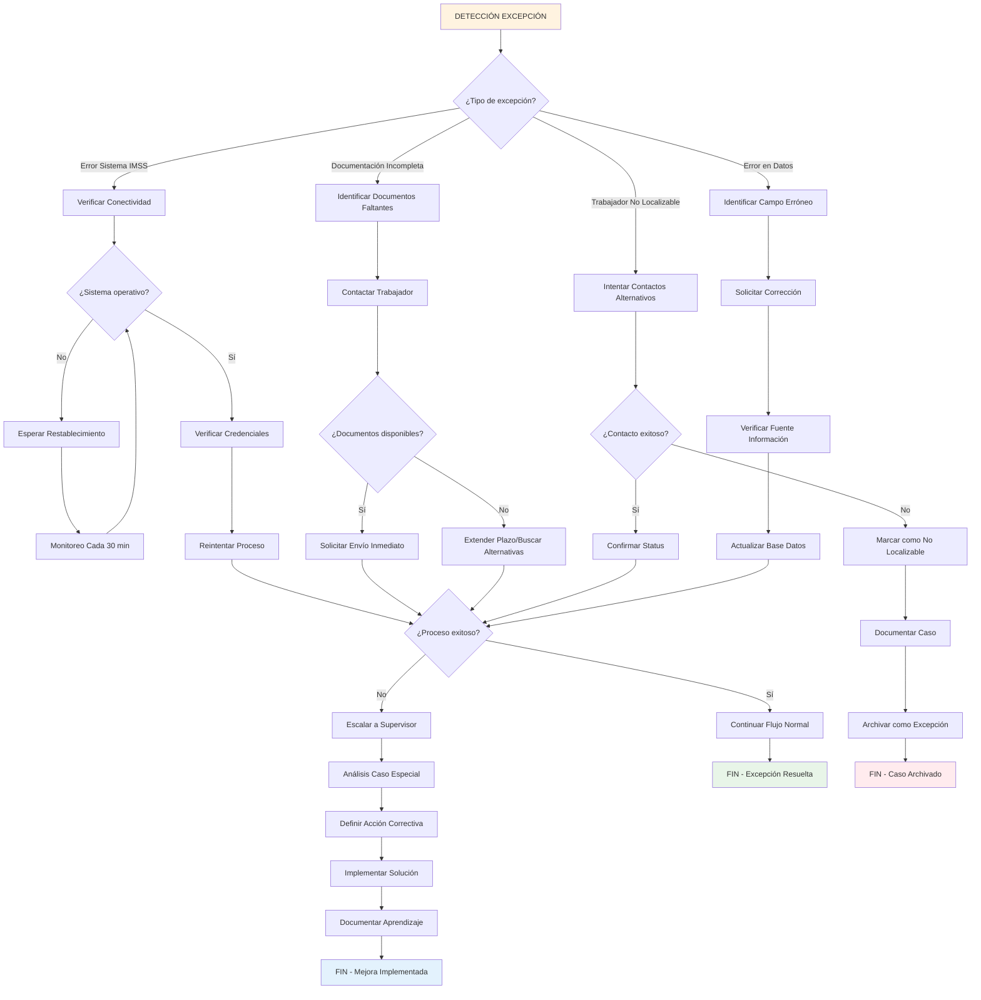
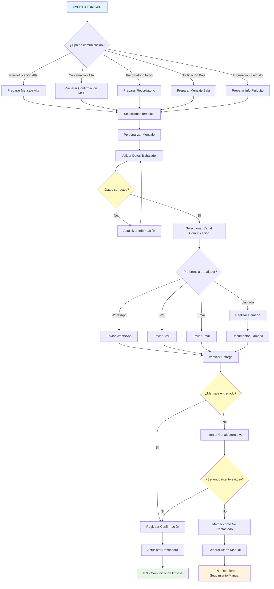

# DIAGRAMAS DE FLUJO - PROCESOS OPERATIVOS
## ALTA/BAJA REPETITIVA DE TRABAJADORES TEMPORALES

### VERSIÓN 1.0 | JUNIO 2025

---

## ÍNDICE DE DIAGRAMAS

1. [FLUJO GENERAL DEL PROCESO](#flujo-general-del-proceso)
2. [PROCESO DE PLANIFICACIÓN](#proceso-de-planificación)
3. [PROCESO DE ALTA IMSS](#proceso-de-alta-imss)
4. [PROCESO DE SEGUIMIENTO](#proceso-de-seguimiento)
5. [PROCESO DE BAJA IMSS](#proceso-de-baja-imss)
6. [MANEJO DE EXCEPCIONES](#manejo-de-excepciones)
7. [FLUJO DE COMUNICACIONES](#flujo-de-comunicaciones)

---

## FLUJO GENERAL DEL PROCESO



---

## PROCESO DE PLANIFICACIÓN



---

## PROCESO DE ALTA IMSS



---

## PROCESO DE SEGUIMIENTO



---

## PROCESO DE BAJA IMSS



---

## MANEJO DE EXCEPCIONES



---

## FLUJO DE COMUNICACIONES



---

## LEYENDA DE SÍMBOLOS

### SÍMBOLOS UTILIZADOS
- **Rectángulo**: Proceso o actividad
- **Rombo**: Decisión o punto de control
- **Círculo**: Inicio o fin de proceso
- **Paralelogramo**: Entrada o salida de datos

### COLORES DE ESTADO
- **Azul claro** (`#e1f5fe`): Inicio de proceso
- **Verde claro** (`#e8f5e8`): Fin exitoso
- **Naranja claro** (`#fff3e0`): Proceso crítico/importante
- **Amarillo claro** (`#fff9c4`): Punto de decisión
- **Rojo claro** (`#ffebee`): Error o problema
- **Azul gris** (`#e3f2fd`): Mejora o aprendizaje

---

## TIEMPOS ESTIMADOS POR PROCESO

| Proceso | Tiempo Promedio | Tiempo Máximo | Recursos Necesarios |
|---------|----------------|---------------|-------------------|
| Planificación completa | 2-4 horas | 8 horas | Jefe Operaciones + RH |
| Alta individual IMSS | 15 minutos | 30 minutos | Coordinador RH |
| Seguimiento diario | 30 minutos | 1 hora | Auxiliar RH |
| Baja individual IMSS | 10 minutos | 20 minutos | Coordinador RH |
| Manejo excepción promedio | 45 minutos | 2 horas | Coordinador + Supervisor |
| Comunicación por trabajador | 5 minutos | 15 minutos | Auxiliar RH |

---

## PUNTOS DE CONTROL CRÍTICOS

### VALIDACIONES OBLIGATORIAS
1. **Verificación documentación** antes de alta IMSS
2. **Confirmación fechas contractuales** vs sistema
3. **Validación datos trabajador** antes de envío
4. **Comprobación entrega comunicaciones** críticas
5. **Verificación baja exitosa** en sistema IMSS

### ALERTAS AUTOMÁTICAS REQUERIDAS
- Documentación incompleta (24 horas antes de alta)
- Fallas en sistema IMSS (tiempo real)
- Trabajador no localizable (48 horas)
- Vencimiento plazos legales (24 horas antes)
- Errores en datos críticos (inmediato)

---

## INTEGRACIÓN CON SISTEMAS

### SISTEMAS PRINCIPALES
- **IMSS IDSE/SUA**: Altas y bajas oficiales
- **Sistema Nómina**: Integración para pagos
- **Control Asistencia**: Seguimiento diario
- **Base Datos RH**: Información trabajadores
- **Dashboard Control**: Monitoreo en tiempo real

### FLUJO DE DATOS
```
Planificación → Base Datos RH → Sistema IMSS → Nómina → Dashboard
     ↓              ↓              ↓           ↓         ↓
Reportes ← Archivo Digital ← Comprobantes ← Alertas ← KPIs
```

---

*Documento técnico - Versión 1.0*  
*Actualización: Junio 2025*  
*Próxima revisión: Diciembre 2025*